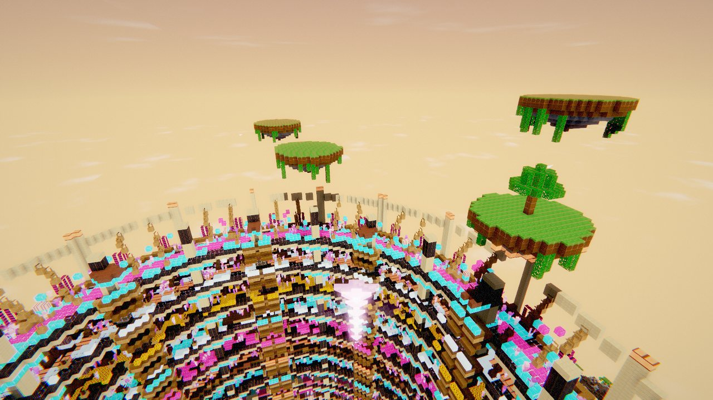
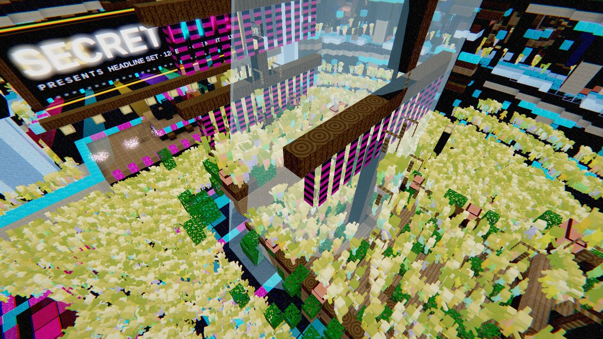
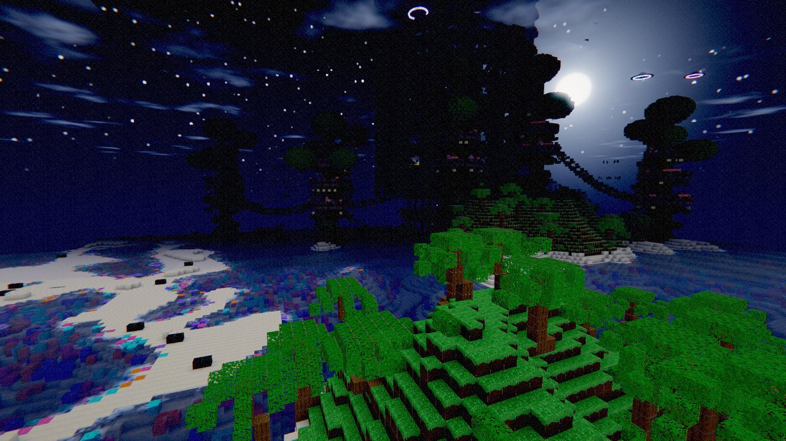

# ATOLL · Voxel Archipelago

A single-file, browser-native voxel world. You wake on a ledge floating above the clouds,
step off the prow, open a glider, and ride the wind down through a procedural archipelago
to a pink portal on the sea floor. The portal opens onto a twenty-district rave cut into
the volcano. An elevator brings you home.

No install, no build step, no bundler: `index.html` is the whole game.



| The Secret Rave | The Canopy City |
| --- | --- |
|  |  |

> **Photosensitivity warning.** The rave uses strobes, lasers and rapid colour flashing.
> They can be switched off before you enter — **Menu → Strobes**, or press `Esc` at any
> time. The setting persists.

## Play it

- **Hosted:** https://d33ai.github.io/MineCraft-Secret-Party/ *(GitHub Pages, deployed from `main` — see [Deployment](#deployment))*
- **Locally:** clone and open `index.html` in a browser. That works from `file://` — no server needed.
- **From source:** `npm run dev`, then open http://127.0.0.1:8080

Requires a browser with **WebGL2** and an internet connection on first load: the engine
(three.js r180) is fetched from a CDN with three mirrors and a self-healing loader. If all
three fail you get a readable fault card, not a black screen.

### Controls

| Desktop | |
| --- | --- |
| `W` `A` `S` `D` | move · `Shift` to sprint |
| `Space` | jump — and **open the glider** while falling |
| `F` | flight (`Space` rise, `Shift` sink) |
| Left click / Right click / Middle | break · place · pick block |
| `1`–`9` `0`, or scroll | select a block |
| `T` `C` `R` `O` | teleport: Aerie · Sky City · Rave · Overlook |
| `G` `H` `P` `M` | screenshot · hide HUD · graphics · sound |
| `Esc` | menu (releases the mouse; click to take it back) |

On touch devices: left thumbstick moves, drag anywhere to look, and **Mine** / **Place** /
**Jump** / **Fly** are on-screen buttons. In flight, **Jump** becomes **Rise** and a
**Sink** button appears. Gamepads are supported.

### URL parameters

Worlds are shareable links — everything except your own edits is a pure function of the seed.

```
index.html#seed=1337     load a specific world
           &q=low        quality: auto | low | medium | high
           &t=0.8        time of day, 0..1
           &test=1       test mode: small crowd, no post, for automation
```

## What is in the world

Terrain is a seeded gradient-noise field with domain warping — barrier reef, lagoon, beach
and volcanic ridge are emergent, not authored. Everything built on top is generated inside
the chunk pipeline as a pure function of world (x, z), so it streams for free and reappears
identically for the same seed:

- **The Aerie** — the spawn. A lens of rock floating at the top of the world with a
  glass-and-timber deck, a prow to step off, and the elevator's top station.
- **The Canopy City** — greatwood trees carrying tiered decks, huts, pods hung in the
  branches, and rope bridges down to the crater rim. Residents live there.
- **The Secret Rave** — a stadium carved into the highest volcanic summit of whatever seed
  you load: 20 themed districts, 20 DJ booths, a galleon, a mainstage, an instanced crowd,
  beams, lasers, pyro and a WebAudio techno set that attenuates with distance.
- **The reef** — coral, fish, seabirds, fireflies, a lighthouse, and the pink portal on the
  sea floor that opens onto the dancefloor.

Your own edits are saved in the browser, per seed (`localStorage`). **Menu → Saved build →
Clear** discards them.

## Development

The game ships as one self-contained `.html` file, but 6,600 lines of JavaScript inside an
HTML file is miserable to edit — so the sources are split and assembled:

```
src/shell.html    DOM + CSS, with a /*__GAME__*/ marker where the module goes
src/game.mjs      the engine and the world
index.html        the shipped build — generated, committed, never hand-edited
```

```bash
npm install          # playwright, for the smoke test — the game itself has no dependencies
npm run dev          # assembles src/ on every request; refresh to see edits
npm run build        # write index.html from src/
npm run check        # node --check + assert index.html matches src/
npm test             # headless gate battery, desktop + mobile viewports
```

**Edit `src/`, then run `npm run build` and commit `index.html` with your change.** CI fails
if the built file is stale. `npm run build` also asserts that every DOM id the game reaches
for exists in the shell, and that all three CDN mirrors survive.

### Tests

`npm test` boots the real build in headless Chromium at 1280×720 and 390×844 and asserts,
per viewport: the world boots with no fault card, chunks stream, every set piece is built,
the crowd is instanced, the player moves and is not clipping into geometry, the hotbar
renders, edits survive a chunk reload, every landmark teleport lands in open air, a reseed
rebuilds the world, the HUD neither leaves the viewport nor overlaps itself, and **zero
console or page errors**.

```bash
npm test                 # both viewports, against the real CDN
npm run test:offline     # caches three.js locally first — deterministic, no egress
npm run test:desktop     # one viewport
node tests/smoke.mjs --headed    # watch it drive the world
```

Frame rate in a headless software rasterizer is meaningless, so nothing asserts on FPS —
the checks query the world's own state through the `window.ATOLL` automation hook.

### The ATOLL console hook

The running game exposes `window.ATOLL` for tooling and for poking around from the console:

```js
ATOLL.gotoRave(); ATOLL.gotoCity(); ATOLL.gotoAerie();
ATOLL.teleport(x, y, z, yaw, pitch);
ATOLL.setTime(0.9);                    // 0..1, freezes the day cycle
ATOLL.surfaceAt(x, z);                 // top solid block, streaming the chunk if needed
ATOLL.world.set(x, y, z, id);          // place a block
ATOLL.chunkCount; ATOLL.crowd; ATOLL.rave; ATOLL.city; ATOLL.portal;
```

See [`docs/ARCHITECTURE.md`](docs/ARCHITECTURE.md) for how the engine is laid out and where
to add things, and [`CONTRIBUTING.md`](CONTRIBUTING.md) for the working rules.

## Deployment

`.github/workflows/pages.yml` builds `index.html` from `src/` and publishes it to GitHub
Pages on every push to `main`. To turn it on: **Settings → Pages → Build and deployment →
Source: GitHub Actions**. The site is `index.html` and nothing else.

## Known limitations

- Water does not flow. Mining below sea level leaves an air pocket, by design.
- Edits live in `localStorage`, so they are per-browser and per-seed. The seed reproduces
  the terrain and every structure, but not your buildings.
- The engine is fetched from a CDN at boot; fully offline play needs a local three.js copy.
- The screenshots above were captured headlessly under a software rasterizer at
  `#q=high` in photo mode. Real hardware looks better and runs far faster.
- Stylized voxel rendering with cosmetic water kinematics — not a photoreal or engineering
  fluid simulation, and it does not claim to be.

## Credits and licence

D33 AI Labs. All art is procedural and original — the texture atlas is generated in code at
boot. No third-party game assets, textures or names are used or required.

Licensed under the [Apache License 2.0](LICENSE).
